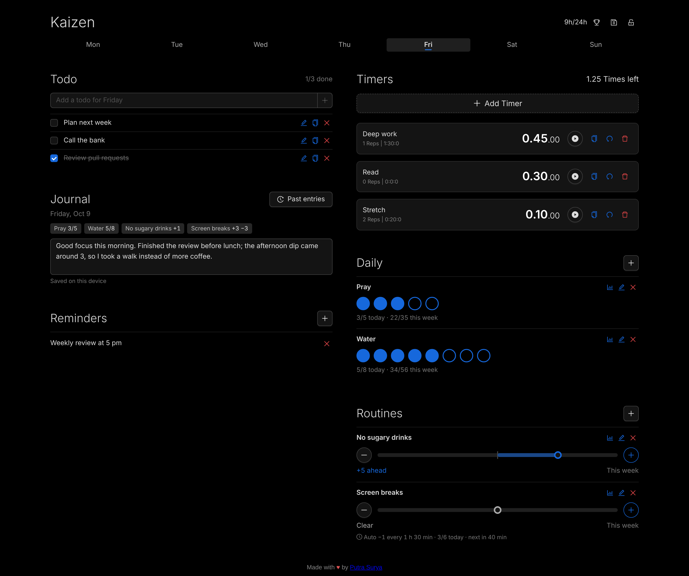

# Kaizen

A private, local-first app for daily improvement: plan your days with todos and timers, build habits, reflect in a journal, and keep a record of the milestones you reach each year. Everything stays on your device, with no account and no server.



## ✨ Features

### Plan your day

One **day picker** drives the whole page. Today is selected by default, and a dot marks days with a running timer.

- **Todo**: A checklist per weekday. Ticks only count for this week, so every week starts unchecked again. Edit in place, or copy a todo to other weekdays.
- **Timers**: Countdown timers per weekday. Each time one reaches zero it buzzes and counts a rep. Copy a timer to other days, and see the total time left for the day plus how many hours are left in today.
- **Reminders**: Quick notes for a weekday that come back every week on that day.

### Build habits

- **Daily**: Habits with a set number per day (pray 5×, 8 glasses of water). Tap circles to fill them. Earlier days this week can be filled in from the day picker; later days are locked.
- **Routines**: A +/− balance for things like resisting an urge. A slip (−) is a debt that good taps (+) pay back. The balance covers Monday to Sunday and starts clear each week, with an undo after every tap.
- **Auto tap**: A routine can tap for you every N minutes, up to a max per day: +1 (credit) for something you resist, or −1 (debt) for something you should do regularly. A tap the other way restarts the timer. It keeps counting while the app is closed, because the count is worked out from the time when you open it (no server or background task).
- **History**: A weekly heatmap for daily habits and owed/ahead bars for routines, starting from the week each habit was created.

### Reflect

- **Journal**: A diary entry per date, saved as you type. Each entry shows how your habits went that day. *Past entries* lists older ones, newest first.
- **Milestones** (🏆 in the header): Your own record of the year. Write down what you reached (anything, not only habits: a certification, a first 10K) with its date and an optional note, plus the goals still to come. Marking a goal achieved moves it into the timeline. Switch years to look back; goals not reached in earlier years can be brought into the new year or left where they were.

### Keep it private and safe

- **Privacy lock** (🔒 in the header): An optional 4-digit PIN that hides Kaizen when you open it or come back to it (immediately, after 1 minute or after 5 minutes). The screen is covered as soon as you leave the app, and running timers keep going underneath. After 5 wrong tries each further one means a wait, starting at 30 seconds. A forgotten PIN can't be recovered: the only way back in is erasing all Kaizen data on the device, which you agree to when setting it up.
- **Backup & restore** (💾 in the header): Download everything as `kaizen-backup-YYYY-MM-DD.json`, and restore it on this or another device. Restoring shows what's in the file and asks before replacing anything, offers Undo afterwards, upgrades older backups, and leaves your PIN as it is.
- **Installable PWA**: Works offline and can be installed on desktop or mobile, with a prompt when a new version is available.
- **Responsive**: A single column with larger touch targets on phones; two columns on wider screens.

## 🔐 How your data is stored

- All data lives in your browser's **localStorage**, on this device only. There's no account, no server and no tracking.
- Each browser and device has its own copy; they don't sync. Use **Backup & restore** to move data between devices.
- Clearing site data in the browser deletes everything. Keep a recent backup.
- Data is **not encrypted**, and neither are backup files. The privacy lock keeps out people who pick up your device; it isn't encryption. Only a salted PBKDF2 hash of the PIN is stored, never the PIN itself.
- The saved format is versioned and migrated automatically when the app updates, so older data and older backups keep working.

## 🗺️ Roadmap

- **Sync between devices** through a hidden folder in your own Google Drive (planned after backup & restore; needs per-item merge support first)
- **Notifications**: in-app first, then push reminders ([#47](https://github.com/putrasurya/kaizen/issues/47))
- **Unlock with fingerprint or face** ([#51](https://github.com/putrasurya/kaizen/issues/51))
- **Timers that keep running** through a browser reload ([#12](https://github.com/putrasurya/kaizen/issues/12))

## 🚀 Quick Start

### Prerequisites

- Node.js ^22.22.2, ^24.15.0, or >=26.0.0 (required by the test environment, jsdom)
- npm (>=8.0.0)

### Installation

1. Clone the repository:
```bash
git clone https://github.com/putrasurya/kaizen.git
cd kaizen
```

2. Install dependencies:
```bash
npm install
```

3. Start the development server:
```bash
npm start
```

Open [http://localhost:5173](http://localhost:5173) to view the app in your browser.

## 🛠️ Available Scripts

### `npm start`
Runs the app in development mode with hot module reloading.

### `npm test`
Runs the test suite once (CI-friendly). Use `npx vitest` for interactive watch mode.

### `npm run build`
Builds the app for production into the `build` folder, including the PWA service worker.

## 🏗️ Technology Stack

- **Frontend**: React 19, JSX
- **UI Framework**: Ant Design 6
- **Styling**: CSS Modules, CSS-in-JS (via Ant Design)
- **State Management**: React Context with `useReducer`, persisted to localStorage with versioned migrations
- **Security**: Web Crypto API (PBKDF2) for the privacy lock PIN
- **Build Tool**: Vite, with `vite-plugin-pwa`
- **Testing**: Vitest, React Testing Library

## 📁 Project Structure

```
src/
├── components/
│   ├── DayPicker.jsx          # Weekday picker that drives every section
│   ├── AppTodo.jsx            # Weekly todo checklist
│   ├── AppTimer.jsx           # Timer list and time-left summary
│   ├── TimerItem.jsx          # A single timer with its controls
│   ├── TimerCountdown.jsx     # Countdown display, alarm and reps
│   ├── AppNote.jsx            # Reminders
│   ├── AppHabits.jsx          # Daily habits and Routines (incl. auto tap status)
│   ├── HabitForm.jsx          # Add/edit a habit, auto tap settings
│   ├── HabitHistory.jsx       # Weekly heatmap and owed/ahead bars
│   ├── AppJournal.jsx         # Journal entry per date, past entries
│   ├── Milestones.jsx         # Yearly milestones and goals
│   ├── LockScreen.jsx         # Privacy lock screen and "forgot PIN"
│   ├── PrivacySettings.jsx    # Set up, change or turn off the PIN
│   ├── PinPad.jsx             # 4-digit PIN pad
│   ├── BackupSettings.jsx     # Download and restore backups
│   ├── AppUpdatePrompt.jsx    # "New version available" prompt
│   └── ...
├── redux/
│   ├── store.jsx              # App state, reducer, persistence, migrations, backups
│   ├── day.jsx                # Selected day and today's date
│   └── privacy.jsx            # Lock state, hide on leave, re-lock timing
├── utilities/
│   ├── auto-tap.js            # Auto tap counts, worked out from time
│   ├── habit-helper.js        # Week math, balances, day summaries
│   ├── privacy-lock.js        # PIN hashing, wait times, erase
│   ├── day-helper.js          # Weekday and date helpers
│   ├── time-helper.js         # Time formatting
│   └── useNow.js              # Re-render on a clock tick and on focus
├── App.jsx                    # Main layout and header buttons
└── index.jsx                  # Entry point
```

## 🐳 Docker Support

The project includes a Dockerfile for containerized deployment:

```bash
# Build the Docker image
docker build -t kaizen:v1.0 .

# Run the container
docker run -p 8080:80 kaizen:v1.0
```

## 🤝 Contributing

1. Fork the repository
2. Create your feature branch (`git checkout -b feature/amazing-feature`)
3. Commit your changes (`git commit -m 'Add some amazing feature'`)
4. Push to the branch (`git push origin feature/amazing-feature`)
5. Open a Pull Request

## 📝 License

This project is licensed under the MIT License - see the [LICENSE](LICENSE) file for details.

## 🙏 Acknowledgments

- Built with [Vite](https://vite.dev/)
- UI components by [Ant Design](https://ant.design/)
- Icons by [Ant Design Icons](https://github.com/ant-design/ant-design-icons)

---

*Kaizen (改善) - Japanese philosophy of continuous improvement in productivity and efficiency.*
